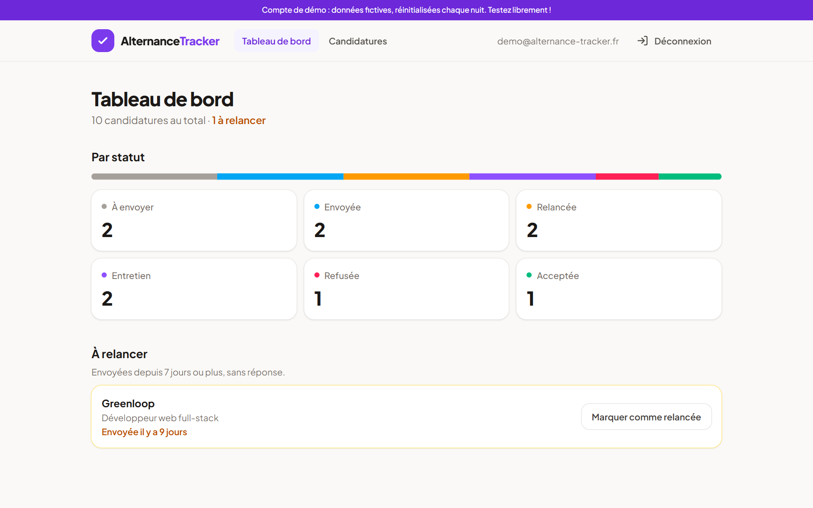
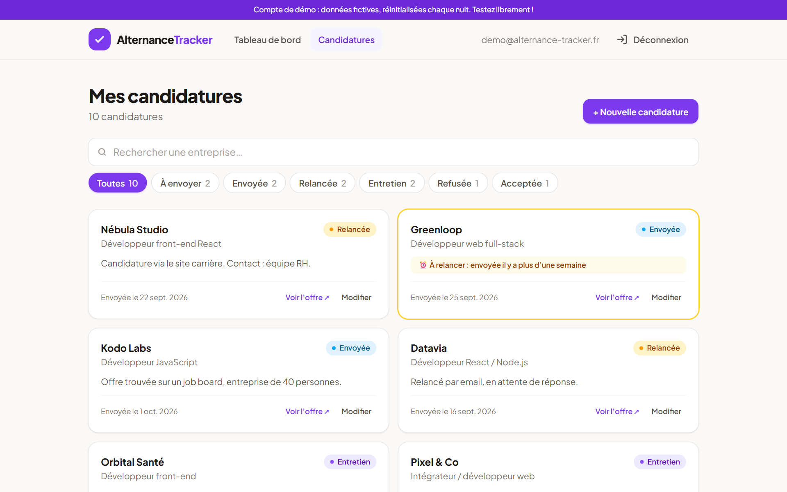
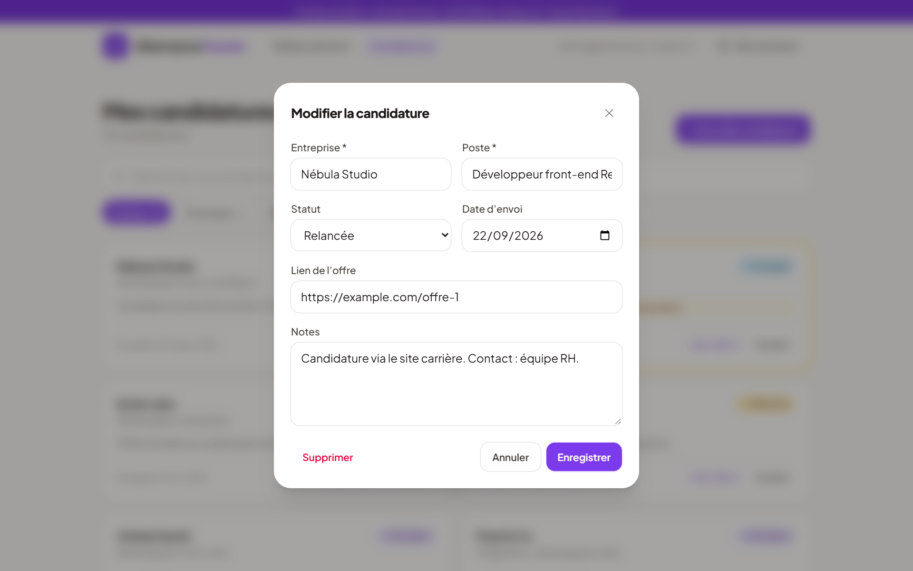
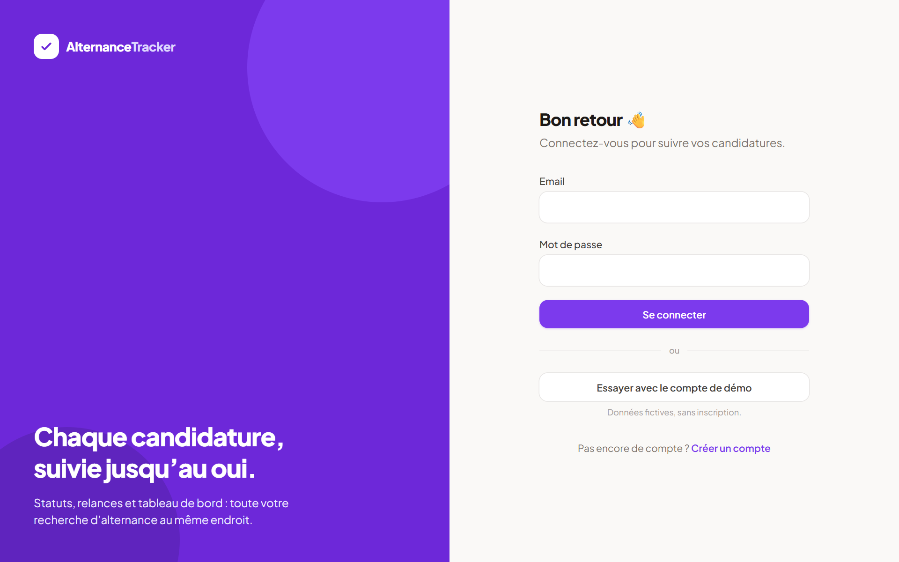
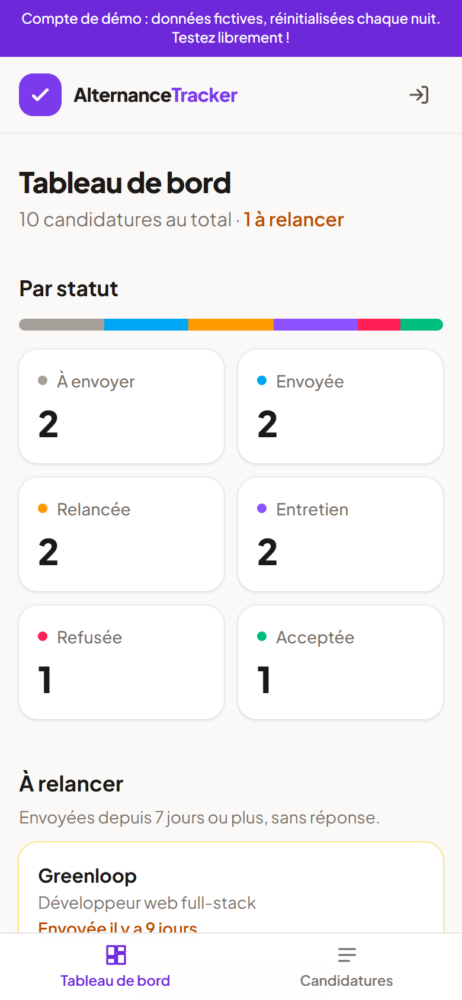
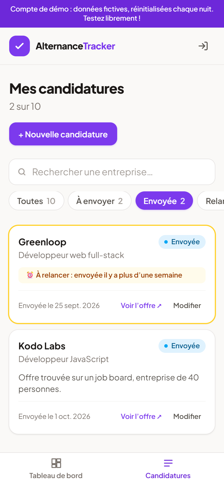

# Alternance Tracker

Application web full-stack pour suivre ses candidatures d'alternance : statuts, relances à faire et tableau de bord. Chaque utilisateur ne voit que ses propres données, grâce aux Row Level Security de PostgreSQL.

**[Voir la démo en ligne](https://tracker-alternance.vercel.app)**

> **Compte de démo** : cliquez sur « Essayer avec le compte de démo » sur la page de connexion, ou utilisez :
> - Email : `demo@alternance-tracker.fr`
> - Mot de passe : `Demo2026!`
>
> Les données de démo sont fictives et réinitialisées chaque nuit. Vous pouvez tout modifier librement.



## Sommaire

- [Fonctionnalités](#fonctionnalités)
- [Captures d'écran](#captures-décran)
- [Stack technique](#stack-technique)
- [Points techniques](#points-techniques)
- [Base de données](#base-de-données)
- [Structure du projet](#structure-du-projet)
- [Installation en local](#installation-en-local)
- [Déploiement sur Vercel](#déploiement-sur-vercel)
- [Pistes d'amélioration](#pistes-damélioration)

## Fonctionnalités

- **Authentification** par email et mot de passe (inscription, connexion, déconnexion, session conservée au rechargement)
- **Gestion des candidatures (CRUD)** : entreprise, poste, lien de l'offre, date d'envoi, statut, notes
- **6 statuts** : à envoyer, envoyée, relancée, entretien, refusée, acceptée
- **Tableau de bord** : nombre de candidatures par statut, barre de répartition, tuiles cliquables qui ouvrent la liste filtrée
- **Relances** : les candidatures « envoyées » depuis 7 jours ou plus sont mises en évidence, et peuvent être marquées comme relancées en un clic depuis le tableau de bord
- **Filtres par statut et recherche par entreprise**, insensible aux accents et aux majuscules, conservés dans l'URL
- **Suppression avec confirmation**
- **Responsive, mobile first** : barre de navigation en bas de l'écran sur mobile, formulaire en panneau coulissant
- **États de chargement** (squelettes), **messages d'erreur** avec bouton « Réessayer », **états vides**
- **Compte de démo** accessible en un clic, réinitialisé automatiquement chaque nuit

## Captures d'écran

| Liste des candidatures | Modification |
| --- | --- |
|  |  |

| Connexion | Mobile : tableau de bord | Mobile : liste filtrée |
| --- | --- | --- |
|  |  |  |

## Stack technique

| Domaine | Outils |
| --- | --- |
| Front-end | React 19, Vite, React Router |
| Style | Tailwind CSS v4 |
| Base de données | PostgreSQL (Supabase) |
| Authentification | Supabase Auth |
| Tests | Vitest |
| Hébergement | Vercel (front), Supabase (base et authentification) |

## Points techniques

### Sécurité des données côté base

La clé Supabase utilisée par le front est publique par conception. La sécurité repose donc sur la base de données, en deux niveaux ([`supabase/schema.sql`](supabase/schema.sql)) :

1. **`GRANT`** : seul le rôle `authenticated` (utilisateur connecté) a accès à la table. Les visiteurs anonymes n'ont aucun droit.
2. **Row Level Security** : une policy par opération (`select`, `insert`, `update`, `delete`) impose `auth.uid() = user_id`. Même en appelant l'API directement, un utilisateur ne peut ni lire ni modifier les lignes d'un autre.

La base valide aussi les données elle-même (contraintes `check` sur le statut et la longueur des champs), et `user_id` est rempli automatiquement avec `default auth.uid()`.

### Architecture : logique séparée de l'affichage

```
pages  ──▶  hooks / context  ──▶  api  ──▶  lib/supabase
(écran)     (état)                (requêtes)  (client unique)
```

- **`api/`** : les seules fonctions qui appellent Supabase
- **`hooks/useApplications`** : la liste, le chargement, l'erreur et les actions (ajout, modification, suppression)
- **`context/AuthContext`** : l'utilisateur connecté, synchronisé avec Supabase via `onAuthStateChange`
- **`utils/`** : les règles métier sous forme de fonctions pures (statuts, relances, filtres, dates), testées avec Vitest
- **`components/`** : des composants d'affichage qui reçoivent leurs données en props

### Tests

Les fonctions utilitaires sont couvertes par des tests unitaires Vitest ([`src/utils/*.test.js`](src/utils)), avec les cas limites (6 ou 7 jours pour une relance, changement de mois, passage à l'heure d'hiver, données manquantes).

La date du jour est passée en paramètre (`needsFollowUp(application, today = new Date())`), ce qui permet de tester avec une date fixe. Les calculs de jours sont faits en UTC sur des jours calendaires, pour ne pas être faussés par le fuseau horaire ni par le changement d'heure.

### Gestion de l'état

- **État dérivé** : la liste filtrée, les compteurs et les relances sont recalculés à partir de la liste des candidatures, jamais stockés en double.
- **Filtres dans l'URL** (`/candidatures?statut=sent&q=doc`) avec `useSearchParams` : le bouton « Retour » fonctionne et le tableau de bord renvoie vers une liste déjà filtrée.
- **Mises à jour sans rechargement complet** : après un enregistrement, la ligne renvoyée par la base remplace ou complète la liste locale.

### Performance

- **Chargement des pages à la demande** avec `React.lazy` et `Suspense`
- **Bibliothèques dans des fichiers séparés** (React et Supabase) pour profiter du cache navigateur entre deux déploiements

### Accessibilité

Labels reliés aux champs, messages d'erreur annoncés (`role="alert"`), `aria-pressed` sur les filtres, `aria-label` sur les boutons-icônes, fenêtre modale native `<dialog>` (touche Échap, focus bloqué dans la fenêtre), contour visible à la navigation au clavier (`:focus-visible`), respect du réglage « réduire les animations ».

### Compte de démo

Une fonction SQL `reset_demo_data()` recrée des données fictives, avec des dates relatives au jour d'exécution. Elle est lancée chaque nuit par une tâche **pg_cron** ([`supabase/demo.sql`](supabase/demo.sql)). Son droit d'exécution est retiré aux rôles publics pour qu'elle ne puisse pas être appelée depuis l'API.

## Base de données

Une table `applications`, liée aux utilisateurs gérés par Supabase (`auth.users`) :

| Colonne | Type | Détail |
| --- | --- | --- |
| `id` | `uuid` | Clé primaire |
| `user_id` | `uuid` | Clé étrangère vers `auth.users`, `on delete cascade` |
| `company`, `position` | `text` | Obligatoires, 1 à 100 caractères |
| `job_url`, `notes` | `text` | Facultatifs |
| `sent_at` | `date` | Date d'envoi |
| `status` | `text` | `to_send`, `sent`, `followed_up`, `interview`, `rejected`, `accepted` |
| `created_at`, `updated_at` | `timestamptz` | `updated_at` mis à jour par un trigger |

## Structure du projet

```
├── supabase/
│   ├── schema.sql        # table, index, trigger, GRANT et policies RLS
│   ├── demo.sql          # données du compte de démo et réinitialisation planifiée
│   └── seed.sql          # données d'exemple pour un compte existant
├── src/
│   ├── api/              # requêtes Supabase (auth, candidatures)
│   ├── components/
│   │   ├── applications/ # carte, liste, formulaire, filtres, badge de statut
│   │   ├── dashboard/    # statistiques, liste des relances
│   │   ├── layout/       # en-tête, navigation, routes protégées
│   │   └── ui/           # boutons, champs, modale, alertes, squelettes
│   ├── context/          # AuthContext
│   ├── hooks/            # useAuth, useApplications
│   ├── lib/              # client Supabase, configuration du compte de démo
│   ├── pages/            # connexion, inscription, tableau de bord, candidatures, 404
│   └── utils/            # fonctions pures et leurs tests
├── vercel.json           # réécriture des routes vers index.html
└── .env.example
```

## Installation en local

**Prérequis** : Node.js 20.19+ ou 22.12+ (exigé par Vite), et un compte [Supabase](https://supabase.com) (gratuit).

1. **Cloner le dépôt et installer les dépendances**

   ```bash
   git clone https://github.com/mehdipares/TrackerAlternance.git
   cd TrackerAlternance
   npm install
   ```

2. **Créer la base de données** : dans un nouveau projet Supabase, ouvrir **SQL Editor** et exécuter le contenu de [`supabase/schema.sql`](supabase/schema.sql).

3. **Configurer les variables d'environnement** : copier `.env.example` en `.env.local` et renseigner l'URL du projet et la clé publique (**Project Settings → API Keys → Publishable key**).

   ```
   VITE_SUPABASE_URL=https://votre-projet.supabase.co
   VITE_SUPABASE_PUBLISHABLE_KEY=sb_publishable_...
   ```

4. **Lancer l'application**

   ```bash
   npm run dev
   ```

5. *Facultatif* : compte de démo. Créer un utilisateur dans **Authentication → Users** (« Auto Confirm User »), activer l'extension **pg_cron**, adapter l'email dans [`supabase/demo.sql`](supabase/demo.sql) puis l'exécuter. Renseigner ensuite `VITE_DEMO_EMAIL` et `VITE_DEMO_PASSWORD`.

### Scripts

| Commande | Rôle |
| --- | --- |
| `npm run dev` | Serveur de développement |
| `npm run build` | Build de production dans `dist/` |
| `npm run preview` | Prévisualisation du build |
| `npm test` | Lancement des tests Vitest |
| `npm run test:watch` | Tests en mode surveillance |

## Déploiement sur Vercel

1. Sur [vercel.com](https://vercel.com), choisir **Add New → Project** et importer le dépôt GitHub. Vite est détecté automatiquement.
2. Dans **Environment Variables**, ajouter `VITE_SUPABASE_URL` et `VITE_SUPABASE_PUBLISHABLE_KEY`, et si besoin `VITE_DEMO_EMAIL` et `VITE_DEMO_PASSWORD`.
3. Cliquer sur **Deploy**. Chaque `git push` sur `main` redéploie ensuite automatiquement.
4. Dans Supabase, sous **Authentication → URL Configuration**, renseigner l'adresse Vercel comme **Site URL** et l'ajouter aux **Redirect URLs**, pour que les liens des emails de confirmation pointent vers le site en ligne.

Le fichier [`vercel.json`](vercel.json) renvoie `index.html` pour toutes les routes. Sans lui, recharger une page comme `/candidatures` renverrait une erreur 404.

## Pistes d'amélioration

- Vue kanban avec glisser-déposer entre les statuts
- Cache des données partagé entre les pages (TanStack Query)
- Passage à TypeScript
- Tests de composants (React Testing Library) et tests de bout en bout
- Rappels par email pour les relances

---

Projet réalisé par [mehdipares](https://github.com/mehdipares) dans le cadre de ma recherche d'alternance en développement web.
